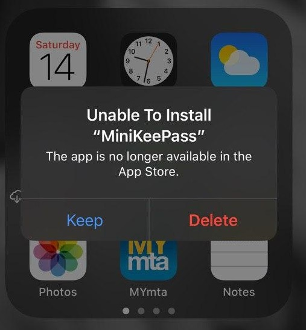
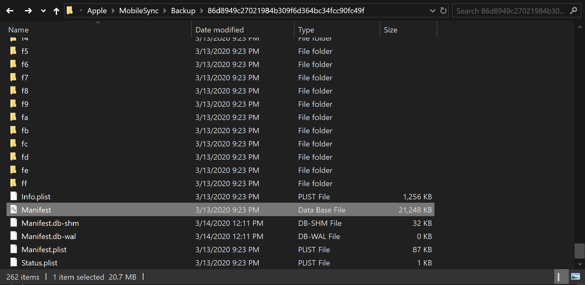
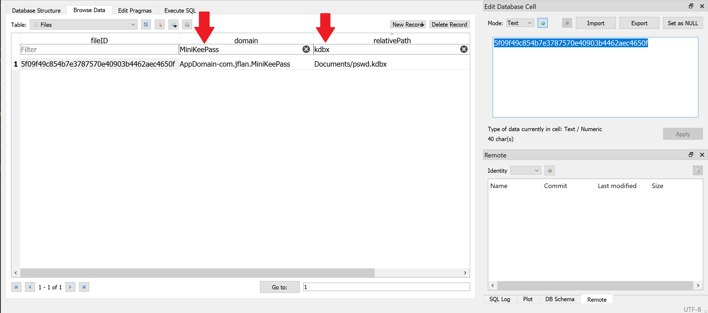
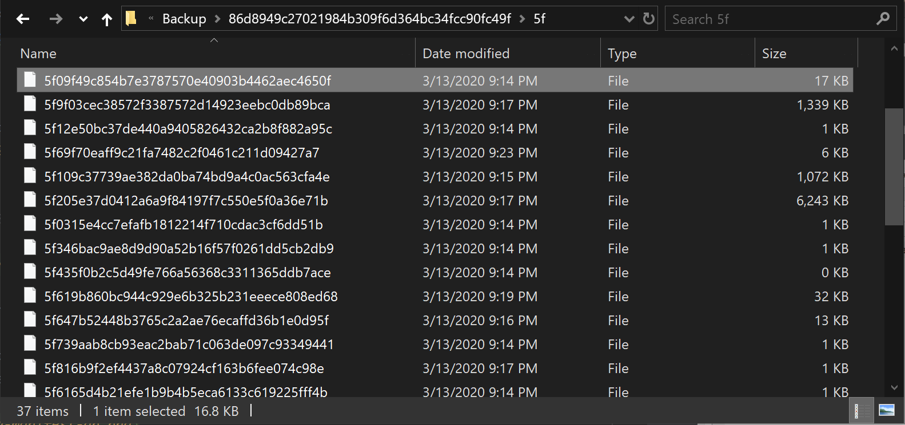

# Can't get access to your `pswd.kdbx` file because MiniKeePass was removed from Apple's App Store?

## Table of Contents
1. [Problem](#problem)
2. [Prerequisites](#prerequisites)
3. [How to recover passwords from backup](#how-to-recover-passwords-from-backup)

## Problem

It is impossible to access on MiniKeePass database after a device with iOS / iPadOS was restored from a backup.
Many of us see this message on their Apple device and start to panic.

I have seen many posts across the web where a lot of people faced the same problem. 
All posts I have seen, suggest using paid software to extract a backup to find a file. 
The price of such software starts at $40. 
I tried using a few pieces of the recommended software to read from backups to recover my password database,
but none were able to help me recover my precious password database. 
Thus, I came up with a solution of my own. 
Most importantly, this solution will guide you through recovering you password database without spending a penny.

## Prerequisites

1. PC or Mac with [iTunes](https://support.apple.com/downloads/itunes) installed
2. Backup* of your iPhone / iPad / iPod
    
    2.1 Follow this [manual](https://support.apple.com/en-us/HT203977#computer) to create a backup* on your computer.
    
    \* if for whatever reason you can't backup your device to PC or Mac, this manual is not for you, sorry.
3. SQLite database viewer such as [sqlitebrowser](https://sqlitebrowser.org/).

## How to recover passwords from backup

1. Once you have created a backup,  you need to locate backup and `Manifest.db` file inside of thereof. Follow this 
[manual](https://support.apple.com/en-us/HT204215#findiTunes) from Apple for instruction on how to locate a backup.
In my case backup was located at: 

    `C:\Users\{user-name}\Apple\MobileSync\Backup\86d8949c27021984b309f6d364bc34fcc90fc49f`
    
    
    
2. Open `Manifest.db` in SQLiteBrowser or any other SQLite DB viewer of your choice.

    2.1 Type `MiniKeePass` as a filter for domain column as shown on the screenshot below.
    2.2 Type `kdbx` as a filter for relativePath column as shown on the screenshot below.
    
    
    
3. Copy UUID from fileID column and search for it in your backup folder. 
(In my case it was: `5f09f49c854b7e3787570e40903b4462aec4650f`)

4. Yay! Congratulations, you've now successfully recovered your `pswd.kdbx` file (trust me, this is the one, 
even though the name is different). Now, download [KeePass](https://keepass.info/download.html) 
client for your computer and open that file you've just found. Voila! You've successfully recovered all your passwords.
    
    
